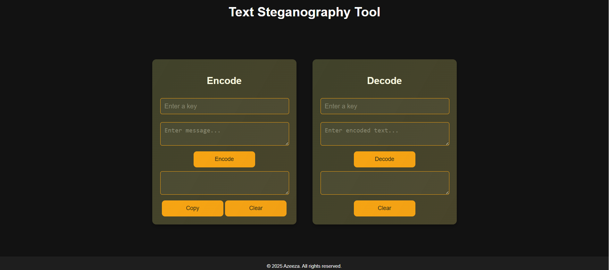

# 📝 Text Steganography

## 🔍 Overview  
**Text Steganography** is a technique that hides secret messages within text, making them undetectable to unauthorized users. This project provides a simple web-based tool to encode and decode hidden messages securely.

## 🚀 Features  
✅ Hide secret messages inside text.  
✅ Extract hidden messages from encoded text.  
✅ User-friendly interface for easy encryption & decryption.  
✅ Supports multiple encoding techniques.  

## 🖥️ Live Demo  
🔗 [Try the tool here!](https://azeezafarhanashaik.github.io/text-stegnography/)

## 📷 Screenshot  

*(Make sure to place the `text-steg.png` file in the root directory of your repository.)*

## 🛠️ Technologies Used  
- **HTML** – Structure of the webpage  
- **CSS** – Styling and design  
- **JavaScript** – Logic for encoding and decoding messages  

## 📌 How to Use  
1. Open the [live demo](https://azeezafarhanashaik.github.io/text-stegnography/).  
2. Enter the secret message and encode it.  
3. Share the encoded text with the intended recipient.  
4. Use the decoding feature to extract the hidden message.  
